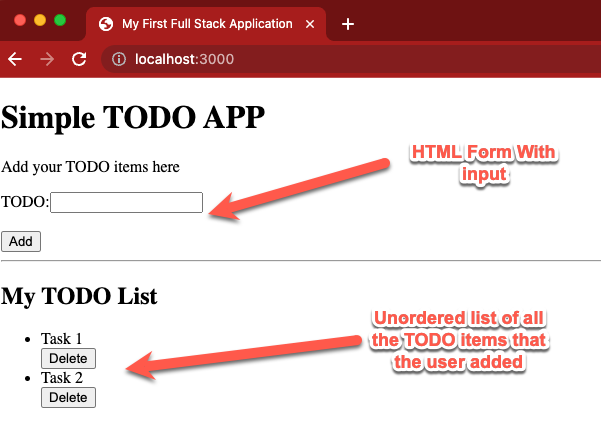

# Project 4

## Overview

In this project we are going to build a simple application that will allow you
to add and delete items to a TODO list. This project will use Pug templates, CSS
and JavaScript.

## Project links

* [Video Walkthrough](https://youtu.be/SbSXki2tAG8)
* [Grading Rubric](https://shanepanter.com/cs208/grading-rubric.html)

## Task 0 - Run the website

For this task all you need to do is make sure that you can run and debug
the website. Use the command below to install all the required tools and
run the website.

```bash
npm install
npm start
```

You should see output similar to what is shown below.

```bash
$ npm start

> web-dev@0.0.1 start
> nodemon src/server.js

[nodemon] 2.0.22
[nodemon] to restart at any time, enter `rs`
[nodemon] watching path(s): *.*
[nodemon] watching extensions: js,mjs,json
[nodemon] starting `node src/server.js`
Listening on port 3000...
```

You can now open up a browser and input [localhost:3000](http://localhost:3000)
to see the website running. Assuming everything worked correctly you can proceed
to the next task.

## Task 1 - Create your Template

In the previous projects we used static HTML and CSS. In this project we will
switch to dynamically generated pages using [pug
templates](https://pugjs.org/api/getting-started.html). Your application will
consist of just one page that will have an HTML form and a list of todo items.
Users will be able to add and delete items from their list.

One easy way to get started using pug is to write your page in HTML and then
[convert](https://html-to-pug.com/) the HTML to pug. You will still have to
modify the generated pug files as they will not have some of the features needed
to display dynamically generated lists. After you are done with this step you
should have a site that looks similar to what is shown below. You are not
expected to match what is shown below exactly you are free to be creative with
your implementation.



- You can reference how to make a form in Section 3.2 of the textbook

## Task 2 - Add CSS

The default styling is pretty plain 🙁. So for this task you need to add some
CSS to make your site look fancy 🎩. You are free to be as creative as you wish.
You will need to add at least 5 CSS rules. For this class I give out extra
credit for the [most ugly site](https://www.theworldsworstwebsiteever.com/). So
feel free to get real weird. Just make sure and keep you website PG-13 rated 👪.

## Task 3 - Add a Database

We will use [sqlite3](https://www.npmjs.com/package/sqlite3) as our database.
[SQLite](https://sqlite.org/index.html) is one of the most popular databases in
the world and is great for small projects and development purposes. SQLlite
understands most of the standard SQL language so as long as you write [ANSI
compatible
SQL](https://blog.ansi.org/2018/10/sql-standard-iso-iec-9075-2016-ansi-x3-135/)
you can switch to any other ANSI compatible database engine without changing
your code 😃. For this project we will just use the in memory database. In a
production environment we would need to make sure our database is loaded and
saved to a file.

When a user submits the form on the main page you will need to add a new TODO
item into your database. You will then need to allow a user to delete a selected
item out of the database.

Here is an example on how to create a table to store all of your data in. This
example uses the AUTOINCREMENT on the primary key to make things easier to keep
track of.

```javascript
db.run(`CREATE TABLE todo (
    id INTEGER PRIMARY KEY AUTOINCREMENT,
    task TEXT NOT NULL)`)
```

Here is an example on how to get all the tasks from the database and add them
to an object which can then be passed to your template.

```javascript
const local = { tasks: [] }
  db.each('SELECT id, task FROM todo', function (err, row) {
    if (err) {
      console.log(err)
    } else {
      local.tasks.push({ id: row.id, task: row.task })
    }
  }, function (err, numrows) {
    if (!err) {
      res.render('index', local)
    } else {
      console.log(err)
    }
  })
```

Here is an example on how to insert and delete something from your database. The
example below is dangerous because it doesn't sanitize the input. Sanitizing
input is important and is left as an extra credit opportunity!

```javascript
const stmt = db.prepare('INSERT INTO todo (task) VALUES (?)')
stmt.run(req.body.todo)
stmt.finalize()

const stmt = db.prepare('DELETE FROM todo where id = (?)')
stmt.run(req.body.id)
stmt.finalize()
```

## Task 4 - Hook up the Backend to the Front end

Now that you have a template on the front end and a database on the backend you
need to hook the two up. Go back to your template file and make sure that you
can add and delete items from your list and add in any additional code to
server.js that is necessary to make things work.

You will need to use a for loop in your pug templates. The example below is
storing the id of each post in a hidden field so when the user clicks the delete
button the form will send the id of the task back to the **server.js** file
where you can then use that id to remove it from the database 😃.

```pug
    ul
    - for (let i = 0; i < tasks.length; i++)
        li= tasks[i].id + " " + tasks[i].task
            form(action="/delete", method="post")
                input(type="hidden", name="id" value=tasks[i].id)
                input(type="submit", value="Delete")
```

## Task 5 - Complete the Retrospective

Once you have completed all the tasks open the file Retrospective.md and complete
each section that has a TODO label. Reference the grading rubric for details on how
this will be graded.

## Task 6 - Add, Commit, Push your code

Once you are finished you need to make sure that you have pushed all your code
to GitHub for grading! The Video walk through linked in the beginning of this
document will show you how to accomplish this task.

## Acceptance Criteria

* You have a complete application that includes front end and backend components
* You have pushed your code to github for grading
